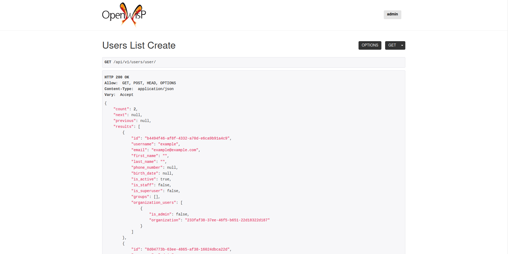

openwisp-users
==============

.. image:: https://travis-ci.org/openwisp/openwisp-users.svg
   :target: https://travis-ci.org/openwisp/openwisp-users

.. image:: https://coveralls.io/repos/openwisp/openwisp-users/badge.svg
  :target: https://coveralls.io/r/openwisp/openwisp-users

.. image:: https://requires.io/github/openwisp/openwisp-users/requirements.svg?branch=master
   :target: https://requires.io/github/openwisp/openwisp-users/requirements/?branch=master
   :alt: Requirements Status

.. image:: https://badge.fury.io/py/openwisp-users.svg
   :target: http://badge.fury.io/py/openwisp-users

------------

Provides basic multi-tenancy features for OpenWISP 2 (using the Django web-framework).

------------

.. contents:: **Table of Contents**:
   :backlinks: none
   :depth: 3

------------

Deploy it in production
-----------------------

An automated installer is available at `ansible-openwisp2 <https://github.com/openwisp/ansible-openwisp2>`_.

Install stable version from pypi
--------------------------------

Install from pypi:

.. code-block:: shell

    pip install openwisp-users

Install development version
---------------------------

Install tarball:

.. code-block:: shell

    pip install https://github.com/openwisp/openwisp-users/tarball/master

Alternatively you can install via pip using git:

.. code-block:: shell

    pip install -e git+git://github.com/openwisp/openwisp-users#egg=openwisp_users

Setup (integrate in an existing django project)
-----------------------------------------------

``INSTALLED_APPS`` in ``settings.py`` should look like the following:

.. code-block:: python

    INSTALLED_APPS = [
        'django.contrib.auth',
        'django.contrib.contenttypes',
        'django.contrib.sessions',
        'django.contrib.messages',
        'django.contrib.staticfiles',
        'openwisp_utils.admin_theme',
        'django.contrib.admin',
        'django.contrib.sites',
        'django_extensions',
        'allauth',
        'allauth.account',
        'allauth.socialaccount',
        'openwisp_users',
        'rest_framework',
        'rest_framework.authtoken',
    ]

also add ``AUTH_USER_MODEL`` and ``SITE_ID`` to your ``settings.py``::

    AUTH_USER_MODEL = 'openwisp_users.User'
    SITE_ID = 1

``urls.py``:

.. code-block:: python

    from django.conf.urls import include, url
    from django.contrib import admin
    from django.contrib.staticfiles.urls import staticfiles_urlpatterns

    urlpatterns = [
        url(r'^admin/', include(admin.site.urls)),
        url(r'^accounts/', include('allauth.urls')),
        url(r'^api/v1/', include('openwisp_users.api.urls')),
    ]

    urlpatterns += staticfiles_urlpatterns()

For additional steps to properly configure ``allauth`` in your project, please refer to their documentation: `allauth documentation installation section <http://django-allauth.readthedocs.io/en/latest/installation.html>`_.

Installing for development
--------------------------

Install sqlite:

.. code-block:: shell

    sudo apt-get install sqlite3 libsqlite3-dev openssl libssl-dev

Install your forked repo:

.. code-block:: shell

    git clone git://github.com/<your_fork>/openwisp-users
    cd openwisp-users/
    python setup.py develop

Install test requirements:

.. code-block:: shell

    pip install -r requirements-test.txt

Start Redis

.. code-block:: shell

    docker-compose up -d

Create database:

.. code-block:: shell

    cd tests/
    ./manage.py migrate
    ./manage.py createsuperuser

Launch development server:

.. code-block:: shell

    ./manage.py runserver

You can access the admin interface at http://127.0.0.1:8000/admin/.

Run tests with:

.. code-block:: shell

    # --parallel and --keepdb are optional but help to speed up the operation
    ./runtests.py --parallel --keepdb

Settings
--------

``OPENWISP_ORGANIZATON_USER_ADMIN``
~~~~~~~~~~~~~~~~~~~~~~~~~~~~~~~~~~~

+--------------+------------------+
| **type**:    | ``boolean``      |
+--------------+------------------+
| **default**: | ``False``        |
+--------------+------------------+

Indicates whether the admin section for managing ``OrganizationUser`` items
is enabled or not.

It is disabled by default because these items can be managed via inline items
in the user administration section.

``OPENWISP_ORGANIZATON_OWNER_ADMIN``
~~~~~~~~~~~~~~~~~~~~~~~~~~~~~~~~~~~~

+--------------+------------------+
| **type**:    | ``boolean``      |
+--------------+------------------+
| **default**: | ``False``        |
+--------------+------------------+

Indicates whether the admin section for managing ``OrganizationOwner`` items
is enabled or not.

It is disabled by default because `OpenWISP <http://openwisp.org>`_ does not use
this feature of `django-organizations <https://github.com/bennylope/django-organizations>`_ yet.

``OPENWISP_USERS_AUTH_API``
~~~~~~~~~~~~~~~~~~~~~~~~~~~

+--------------+--------------+
| **type**:    | ``boolean``  |
+--------------+--------------+
| **default**: | ``False``    |
+--------------+--------------+

Indicates whether the API is enabled or not.

``OPENWISP_USERS_AUTH_THROTTLE_RATE``
~~~~~~~~~~~~~~~~~~~~~~~~~~~~~~~~~~~~~

+--------------+--------------+
| **type**:    | ``str``      |
+--------------+--------------+
| **default**: | ``100/day``  |
+--------------+--------------+

Indicates the rate throttling for the API authentication endpoint.

Please note that the current rate throttler is very basic and will
also count valid requests for rate limiting. For more information,
check Django-rest-framework
`throttling guide <https://www.django-rest-framework.org/api-guide/throttling/>`_.

REST API
--------

To enable the API the setting
`OPENWISP_USERS_AUTH_API <#openwisp-users-auth-api>`_
must be set to ``True``.

Live documentation
~~~~~~~~~~~~~~~~~~

A general live API documentation (following the OpenAPI specification) at ``/api/v1/docs/``.

Browsable web interface
~~~~~~~~~~~~~~~~~~~~~~~

Additionally, opening any of the endpoints listed below
directly in the browser will show the `browsable API interface of Django-REST-Framework
<https://www.django-rest-framework.org/topics/browsable-api/>`_,
which makes it even easier to find out the details of each endpoint.

Obtain Authentication Token
~~~~~~~~~~~~~~~~~~~~~~~~~~~

.. code-block:: text

    /api/v1/user/token/

This endpoint only accepts the ``POST`` method and is used to retrieve the
Bearer token that is required to make API requests to other endpoints.

Example usage of the endpoint:

.. code-block:: shell

    http POST localhost:8000/api/v1/user/token/ username=openwisp password=1234

    HTTP/1.1 200 OK
    Allow: POST, OPTIONS
    Content-Length: 52
    Content-Type: application/json
    Date: Wed, 13 May 2020 10:59:34 GMT
    Server: WSGIServer/0.2 CPython/3.6.9
    Vary: Cookie
    X-Content-Type-Options: nosniff
    X-Frame-Options: DENY

    {
        "token": "7a2e1d3d008253c123c61d56741003db5a194256"
    }

Authenticating with the user token
~~~~~~~~~~~~~~~~~~~~~~~~~~~~~~~~~~

The authentication class ``openwisp_users.api.authentication.BearerAuthentication``
is used across the different OpenWISP modules for authentication.

To use it, first of all get the user token as described above in
`Obtain Authentication Token <#obtain-authentication-token>`_, then send
the token in the ``Authorization`` header:

.. code-block:: shell

    # get token
    TOKEN=$(http POST :8000/api/v1/user/token/ username=openwisp password=1234 | jq -r .token)

    # send bearer token
    http GET localhost:8000/api/v1/firmware/build/ "Authorization: Bearer $TOKEN"

Model helpers
-------------

The User model provides the following methods to check whether the user
is a member or an administrator of an organization:

* `def is_manager(self, organization)`
* `def is_member(self, organization)`

Multitenancy mixins
-------------------

* **MultitenantAdminMixin**: adding this mixin to a ``ModelAdmin`` class will make it multitenant.
  Set ``multitenant_shared_relations`` to the list of parameters you wish to have only organization
  specific options.

* **MultitenantOrgFilter**: admin filter that shows only organizations the current user is associated with in its available choices.

* **MultitenantRelatedOrgFilter**: similar ``MultitenantOrgFilter`` but shows only objects which have a relation with
  one of the organizations the current user is associated with.

Contributing
------------

1. Announce your intentions in the `OpenWISP Mailing List <https://groups.google.com/d/forum/openwisp>`_
2. Fork this repo and install it
3. Follow `PEP8, Style Guide for Python Code`_
4. Write code
5. Write tests for your code
6. Ensure all tests pass
7. Ensure test coverage does not decrease
8. Document your changes
9. Send pull request

.. _PEP8, Style Guide for Python Code: http://www.python.org/dev/peps/pep-0008/

Changelog
---------

See `CHANGES <https://github.com/openwisp/openwisp-users/blob/master/CHANGES.rst>`_.

License
-------

See `LICENSE <https://github.com/openwisp/openwisp-users/blob/master/LICENSE>`_.

Support
-------

See `OpenWISP Support Channels <http://openwisp.org/support.html>`_.
