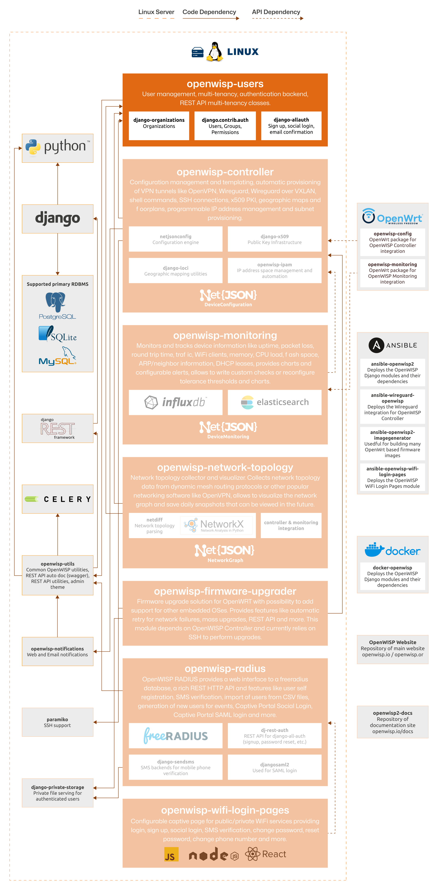

Users
=====

.. seealso::

    **Source code**: `github.com/openwisp/openwisp-users
    <https://github.com/openwisp/openwisp-users>`_.

The OpenWISP Users module leverages the capabilities of the `Django
Framework <https://djangoproject.com/>`_ and its rich ecosystem to provide
OpenWISP with features for managing user accounts, permission groups,
supporting different authentication schemes, implementing multi-tenancy
for allowing multiple organizations to be managed by different users
within a single OpenWISP instance and more.

For a full introduction please refer to :doc:`user/intro`.

The following diagram illustrates the role of the Users module within the
OpenWISP architecture.

    **OpenWISP Architecture: highlighted users module**

.. important::

    For an enhanced viewing experience, open the image above in a new
    browser tab.

    Refer to :doc:`/general/architecture` for more information.

.. toctree::
    :caption: Users Module Usage Docs
    :maxdepth: 1

    user/intro.rst
    user/basic-concepts.rst
    user/management-commands.rst
    user/settings.rst
    user/rest-api.rst

.. toctree::
    :caption: Users Module Developer Docs
    :maxdepth: 2

    Developer Docs Index <developer/index.rst>
